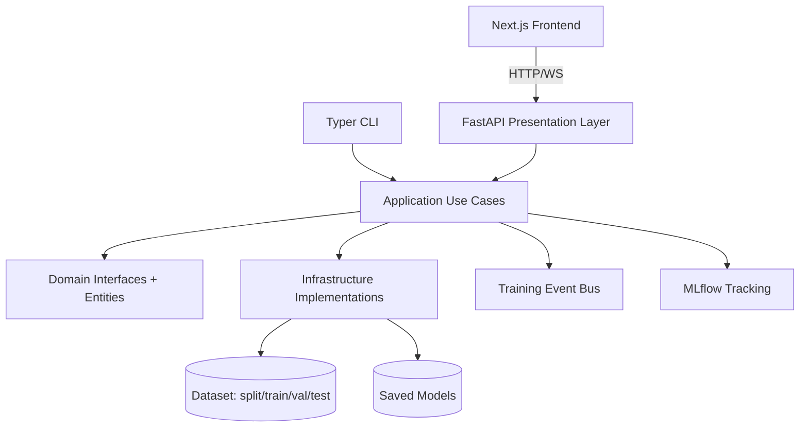

# 🤟 ASL Recognition Platform

A full-stack American Sign Language (ASL) recognition system with:
- 🧠 ML training and inference pipeline (29 classes)
- ⚡ FastAPI backend (REST + WebSocket)
- 🖥️ Next.js frontend dashboard
- 🧩 Clean AVrchitecture + Dependency Injection
- 🐳 Dockerized API + MLflow services

This project is designed for both experimentation and production-style structure.

## ✨ What This Project Does

- 📥 Prepares ASL dataset (download/split) with local fallback support
- 🏋️ Trains image classification models (MobileNetV2 / EfficientNetB0)
- 📊 Tracks experiments with MLflow
- 🔍 Predicts sign labels from uploaded images
- 📹 Streams real-time predictions over WebSocket
- 🔐 Secures endpoints with JWT auth
- 🧪 Includes unit/integration/e2e test structure

## 🧱 Architecture Overview

The backend follows Clean Architecture principles:
- `domain`: core business entities, contracts, domain exceptions
- `application`: use-cases, DTOs, orchestration services, events
- `infrastructure`: external implementations (ML models, data, persistence, hand detection)
- `presentation`: delivery layers (API, CLI, webcam UI)
- `config`: settings + dependency injection container



### 🧩 Dependency Injection

`src/asl/config/container.py` wires:
- backbone strategy selection
- repository implementations
- use case factories
- inference/training services
- auth and API key handlers

This keeps modules decoupled and easy to test.

## 🗂️ Project Structure

```text
asl-recognition/
├─ asl-ui/                    # Next.js frontend dashboard
├─ configs/                   # YAML configs (model/training)
├─ data/                      # Dataset split folders (ignored by git)
├─ docker/                    # Dockerfile + docker-compose
├─ models/                    # Trained model artifacts (ignored by git)
├─ notebooks/                 # Experiments and exploration notebooks
├─ scripts/                   # Utility scripts (calibration/smoke tests)
├─ src/asl/
│  ├─ application/            # Use cases + services + DTO/events
│  ├─ config/                 # Settings + DI container
│  ├─ domain/                 # Entities + contracts + domain errors
│  ├─ infrastructure/         # ML/data/persistence implementations
│  └─ presentation/           # API, CLI, websocket, webcam
├─ tests/                     # Unit / integration / e2e tests
├─ pyproject.toml             # Python dependencies + tooling
└─ README.md
```

## 🚀 Quick Start

### 1) Backend Setup (Python)

Requirements:
- Python 3.10 - 3.13
- pip

Install dependencies:

```bash
pip install -e ".[dev]"
```

Copy environment template:

```bash
cp .env.example .env
```

On Windows PowerShell:

```powershell
Copy-Item .env.example .env
```

⚠️ Important security step:
- Set `AUTH__SECRET_KEY` in `.env` before deploying.

Run API server:

```bash
uvicorn asl.presentation.api.app:app --host 0.0.0.0 --port 8000 --reload
```

Open docs:
- Swagger: `http://localhost:8000/docs`
- ReDoc: `http://localhost:8000/redoc`
- Health: `http://localhost:8000/health`

### 2) Frontend Setup (Next.js)

```bash
cd asl-ui
npm install
npm run dev
```

Frontend runs at:
- `http://localhost:3000`

By default frontend calls:
- `NEXT_PUBLIC_API_URL` or fallback `http://localhost:8000`

## 🔐 Authentication

- Login endpoint: `POST /api/v1/auth/token`
- Receive JWT bearer token
- Use token in:
  - `Authorization: Bearer <token>` for REST endpoints
  - `?token=<jwt>` query for WebSocket `/api/v1/stream`

Default bootstrap user is configured in DI container:
- Username: `admin`
- Password hash corresponds to a default `changeme` password

✅ Change this for real deployments.

## 📡 API Endpoints

Base prefix: `/api/v1`

- `POST /auth/token` - issue JWT
- `POST /predict` - classify uploaded image (`multipart/form-data`)
- `POST /train` - queue background training (admin-only)
- `WS /stream` - real-time frame-by-frame predictions
- `GET /health` - service status

## 🧪 CLI Commands

The project installs a CLI entrypoint `asl`:

```bash
asl prepare
asl train --phase1-epochs 10 --phase2-epochs 5 --model-name asl_model
asl evaluate asl_model
asl webcam --model-name asl_model
```

## 🐳 Docker

Run backend API + MLflow:

```bash
cd docker
docker compose up --build
```

Services:
- API: `http://localhost:8000`
- MLflow: `http://localhost:5000`

## 🧪 Testing

Run unit + integration tests:

```bash
pytest -q tests/unit tests/integration
```

Coverage options are configured in `pyproject.toml`.

## ⚙️ Configuration

Main settings are loaded from `.env` using nested keys:
- `AUTH__*`
- `DATA__*`
- `MODEL__*`
- `TRAINING__*`
- `API__*`

Examples are provided in `.env.example`.

## 🧠 Model and Data Notes

- `data/` and `models/` are intentionally ignored by git
- model files (`*.keras`, `*.h5`) are ignored
- this keeps repository size manageable and avoids committing large binaries

## 🛡️ Production Notes

Before production use:
- rotate `AUTH__SECRET_KEY`
- replace bootstrap credentials
- restrict CORS origins (`API__CORS_ORIGINS`)
- use strong API keys if API-key mode is enabled
- pin infrastructure resources (CPU/GPU/memory)

## 📌 Tech Stack

- Backend: FastAPI, Pydantic Settings, Dependency Injector, Typer
- ML: TensorFlow, MediaPipe, Transformers, scikit-learn, OpenCV
- Frontend: Next.js 15, React 19, Zustand, Tailwind CSS
- Tracking: MLflow
- Testing: pytest

---

Built for practical ASL recognition workflows: train, evaluate, serve, and stream in one structured codebase. 🤟